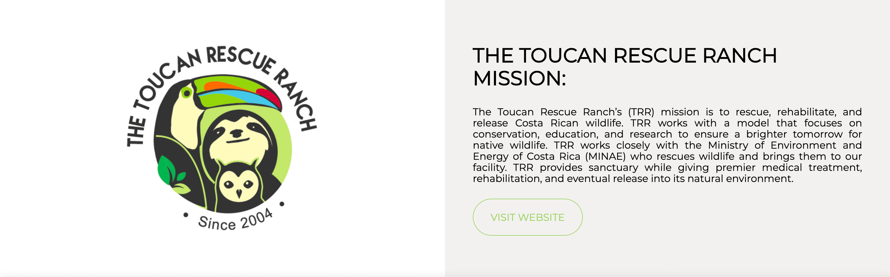

# SuperSloth
### *//Russian version*

Тут все очень просто, как и сам сайт. Проект для практики CSS Grid и CSS animation. Сайт посвящён и сделан в поддержку организациям помогающим животным в Коста Рике.

Поближе с проектом вы можете познакомиться по [ссылке]()

### *//English version*

Everything is very simple here, just like the website itself. Training fun-project for CSS Grid and CSS animation practice. The site is dedicated to and made in support of organizations that help animals in Costa Rica.

You can learn more about the project by following the [link]()

# Скриншоты/Screenshots 

